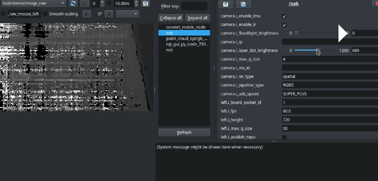
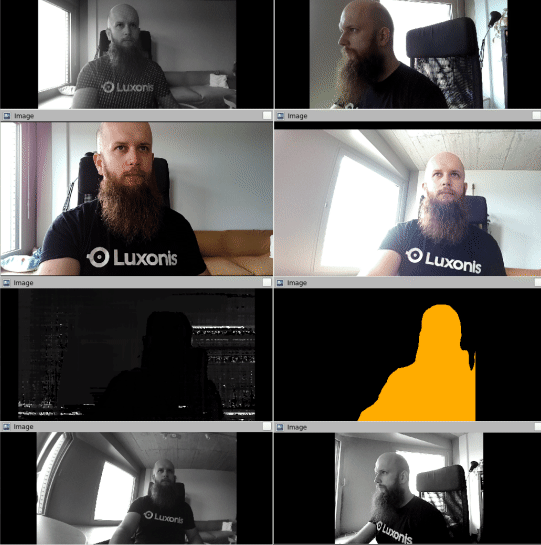

# Depthai ROS Repository
Hi and welcome to the main depthai-ros respository! Here you can find ROS related code for OAK cameras from Luxonis. Don't have one? You can get them [here!](https://shop.luxonis.com/)

Main features:

* You can use the cameras as classic RGBD sensors for your 3D vision needs.
* You can also load Neural Networks and get the inference results straight from camera!

You can develop your ROS applications in following ways:

  * Use classes provided in `depthai_bridge` to construct your own driver (see `stereo_inertial_node` example on how to do that)
  * Use `depthai_ros_driver` class (currently available on ROS2 Humble & Noetic) to get default experience (see details below on how) 


Supported ROS versions:
- Noetic
- Galactic
- Humble

For usage check out respective git branches.

## Docker
You can additionally build and run docker images on your local machine. To do that, **add USB rules as in above step**, clone the repository and inside it run (it matters on which branch you are on):
```
docker build --build-arg USE_RVIZ=1 -t depthai_ros .
```
If you find out that you run out of RAM during building, you can also set `BUILD_SEQUENTIAL=1` to build packages one at a time, it should take longer, but use less RAM.

`RUN_RVIZ` arg means rviz will be installed inside docker. If you want to run it you need to also execute following command (you'll have to do it again after restarting your PC):
```
xhost +local:docker
```

Then you can run your image in following way:
```
docker run -it -v /dev/:/dev/ --privileged -e DISPLAY -v /tmp/.X11-unix:/tmp/.X11-unix depthai=ros
```
will run an interactive docker session. You can also try:

```
docker run -it -v /dev/:/dev/ --privileged -e DISPLAY -v /tmp/.X11-unix:/tmp/.X11-unix depthai-ros:humble roslaunch depthai_examples stereo_inertial_node.launch.py
```
to run a launch file of your choice.

**NOTE** ROS2 Humble docker image uses Cyclone as RMW implementation.
### Running docker iamge on ROS1
```
docker run -it -v /dev/:/dev/ --privileged -e DISPLAY -v /tmp/.X11-unix:/tmp/.X11-unix depthai_ros roslaunch depthai_examples stereo_inertial_node.launch
```
Will only start `stereo_inertial_node` launch file (you can try different commands).
### Running docker iamge on ROS2
```
docker run -it -v /dev/:/dev/ --privileged -e DISPLAY -v /tmp/.X11-unix:/tmp/.X11-unix depthai_ros roslaunch depthai_examples stereo_inertial_node.launch.py
```

### Install from ros binaries

Add USB rules to your system
```
echo 'SUBSYSTEM=="usb", ATTRS{idVendor}=="03e7", MODE="0666"' | sudo tee /etc/udev/rules.d/80-movidius.rules
sudo udevadm control --reload-rules && sudo udevadm trigger
```
Install depthai-ros. (Available for Noetic, foxy, galactic and humble)
`sudo apt install ros-<distro>-depthai-ros`


## Install from source

### Install dependencies

The following script will install depthai-core and update usb rules and install depthai devices

```
sudo wget -qO- https://raw.githubusercontent.com/luxonis/depthai-ros/main/install_dependencies.sh | sudo bash
```
if you don't have opencv installed then try `sudo apt install libopencv-dev`


if you don't have rosdep installed and not initialized please execute the following steps:
1. `sudo apt install python-rosdep`(melodic) or `sudo apt install python3-rosdep`
2. `sudo rosdep init`
3. `rosdep update`

### Setting up procedure
The following setup procedure assumes you have cmake version >= 3.10.2 and OpenCV version >= 4.0.0. We selected `dai_ws` as the name for a new folder, as it will be our depthai ros workspace.

1. `mkdir -p dai_ws/src`
2. `cd dai_ws/src`
3. `git clone https://github.com/luxonis/depthai-ros.git`
4. `cd ../..`
5. `rosdep install --from-paths src --ignore-src -r -y`
6. `source /opt/ros/<ros-distro>/setup.bash`
7. `catkin_make` (For ROS1) `colcon build` (for ROS2)
8. `source devel/setup.bash` (For ROS1) & `source install/setup.bash` (for ROS2) 

**Note** If you are using a lower end PC or RPi, standard building may take a lot of RAM and clog your PC. To avoid that, you can use `build.sh` command from your workspace (it just wraps colcon commands):
`./src/depthai-ros/build.sh`

### Depthai ROS Driver

Currently, recommended way to launch cameras is to use executables from depthai_ros_driver package. 

This runs your camera as a ROS2 Component and gives you the ability to customize your camera using ROS parameters. 
Paramerers that begin with `r_` can be freely modified during runtime, for example with rqt. 
Parameters that begin with `i_` are set when camera is initializing, to change them you have to call `stop` and `start` services. This can be used to hot swap NNs during runtime, changing resolutions, etc. Below you can see some examples:

#### Setting RGB parameters

#### Setting Stereo parameters

#### Stopping/starting camera for power saving/reconfiguration


Stopping camera also can be used for power saving, as pipeline is removed from the device. Topics are also removed when camera is stopped.

As for the parameters themselves, there are a few crucial ones that decide on how camera behaves.
* `camera_i_pipeline_type` can be either `RGB` or `RGBD`. This tells the camera whether it should load stereo components. Default set to `RGBD`
* `camera_i_nn_type` can be either `none`, `rgb` or `spatial`. This is responsible for whether the NN that we load should also take depth information (and for example provide detections in 3D format). Default set to `spatial`
* `camera_i_mx_id`/`camera_i_ip` are for connecting to a specific camera. If not set, it automatically connects to the next available device.
* `nn_i_nn_config_path` represents path to JSON that contains information on what type of NN to load, and what parameters to use. Currently we provide options to load MobileNet, Yolo and Segmentation (not in spatial) models. To see their example configs, navigate to `depthai_ros_driver/config/nn`. Defaults to `mobilenet.json` from `depthai_ros_driver`

To use provided example NN's, you can set the path to:
* `depthai_ros_driver/segmentation`
* `depthai_ros_driver/mobilenet`
* `depthai_ros_driver/yolo`

All available camera-specific parameters and their default values can be seen in `depthai_ros_driver/config/camera.yaml`.

Currently, we provide few examples:

* `camera.launch` launches camera in RGBD, and NN in spatial (Mobilenet) mode.
* `rgbd_pcl.launch` launches camera in basic RGBD configuration, doesn't load any NNs. Also loads ROS depth processing nodes for RGBD pointcloud.
* `example_multicam.launch` launches several cameras at once, each one in different container. Edit the `multicam_example.yaml` config file in `config` directory to change parameters


* `example_segmentation.launch` launches camera in RGBD + semantic segmentation (pipeline type=RGBD, nn_type=rgb)
* `pointcloud.launch` - similar to `rgbd_pcl.launch.py`, but doesn't use RGB component for pointcloud
* `example_marker_publish.launch` launches `camera.launch.py` + small python node that publishes detected objects as markers/tfs
* `rtabmap.launch` launches camera and RTAB-MAP RGBD SLAM (you need to install it first - `sudo apt install ros-$ROS_DISTRO-rtabmap-ros`). You might need to set manual focus via parameters here.

## Executing an example

### ROS1
1. `cd dai_ws` (Our workspace)
2. `source devel/setup.bash`
3. `roslaunch depthai_examples stereo_inertial_node.launch` - example node
For more examples please check the launch files.

### ROS2
1. `cd dai_ws` (Our workspace)
2. `source install/setup.bash`
3. `ros2 launch depthai_examples stereo_inertial_node.launch.py` - example node
For more examples please check the launch files.


## Running Examples

### Mobilenet Publisher:
#### ROS1:
##### OAK-D
```
roslaunch depthai_examples mobile_publisher.launch camera_model:=OAK-D
```
##### OAK-D-LITE
```
roslaunch depthai_examples mobile_publisher.launch camera_model:=OAK-D-LITE
```
##### With visualizer
```
roslaunch depthai_examples mobile_publisher.launch | rqt_image_view -t /mobilenet_publisher/color/image
```

#### ROS2:

##### OAK-D
```
ros2 launch depthai_examples mobile_publisher.launch.py camera_model:=OAK-D
```

##### OAK-D-LITE
```
ros2 launch depthai_examples mobile_publisher.launch.py camera_model:=OAK-D-LITE
```


### Testing results
- ImageConverter - Tested using `roslaunch depthai_examples stereo_inertial_node.launch` && `roslaunch depthai_examples rgb_publisher.launch`'
- ImgDetectionCnverter - tested using `roslaunch depthai_examples mobile_publisher.launch`
- SpatialImgDetectionConverter - Ntested using `roslaunch depthai_examples stereo_inertial_node.launch`


### Users can write Custom converters and plug them in for bridge Publisher. 
If there a standard Message or usecase for which we have not provided a ros msg or
 converter feel free to create a issue or reach out to us on our discord community. We would be happy to add more. 

### Developers guide

For easier development inside isolated workspace, one can use Visual Studio Code with DevContainers plugin, to do that:
- Create separate workspace
- Clone repository into src
- Copy `.devcontainer` directory into main workspace directory
- Open workspace directory in VSCode